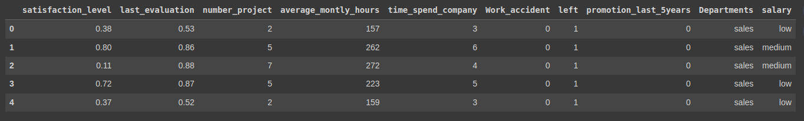
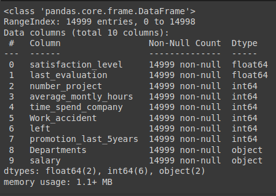
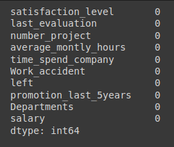
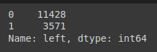
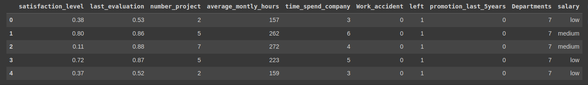
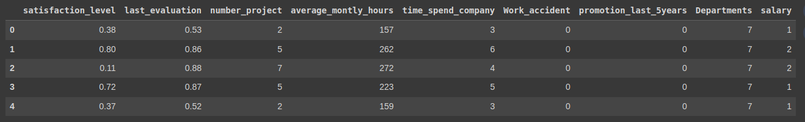
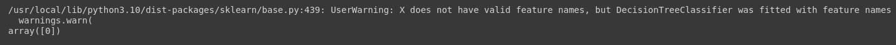

# Implementation-of-Decision-Tree-Classifier-Model-for-Predicting-Employee-Churn

## AIM:
To write a program to implement the Decision Tree Classifier Model for Predicting Employee Churn.

## Equipments Required:
1. Hardware – PCs
2. Anaconda – Python 3.7 Installation / Jupyter notebook

## Algorithm
1. Import the necessary libraries.
2. Gather information from the data.
3. Implement Label Encoding.
4. Train the model using Decision Tree Classifier.
5. Calculate the accuracy score.
6. Predict the outcome with a different data.

## Program:
```python
# Program to implement the Decision Tree Classifier Model for Predicting Employee Churn.
# Developed by   : Sam Israel D
# RegisterNumber : 212222230128
```
#### Import pandas library and read the csv file.
```python
import pandas as pd
df = pd.read_csv('Employee.csv')
```
#### Gather information from the data.
```python
df.head()
df.info()
df.describe()
df.isnull().sum()
```
```python
df['left'].value_counts()
```
#### Label Encode the necessary fields.
```python
from sklearn.preprocessing import LabelEncoder
le = LabelEncoder()
df['salary'] = le.fit_transform(df['salary'])
df.head()
df['Departments '] = le.fit_transform(df['Departments '])
df.info()
```
#### Create a new dataset with the required fields.
```python
x = df[['satisfaction_level', 'last_evaluation', 'number_project','average_montly_hours', 'time_spend_company', 'Work_accident', 'promotion_last_5years', 'Departments ', 'salary' ] ]
x.head()
```
```python
y = df['left']
```
#### Split the dataset for training and testing.
```python
from sklearn.model_selection import train_test_split
x_train, x_test, y_train, y_test = train_test_split(x,y,test_size=0.2, random_state=100)
```
#### Using Decision Tree Classifier, train the model.
```python
from sklearn.tree import DecisionTreeClassifier
dt = DecisionTreeClassifier(criterion = "entropy")
dt.fit(x_train, y_train)
y_pred = dt.predict(x_test)
```
#### Calculate the accuracy.
```python
from sklearn import metrics
accuracy = metrics.accuracy_score(y_test, y_pred)
print(f'Accuracy : {accuracy*100}')
```
#### Predict the outcome with a different data.
```python
dt.predict([[0.5,0.8,9,260,6,0,1,1,2]])
```
## Output:

#### Data head

#### Dataset info

#### Null dataset

#### Values count in left column

#### Dataset transformed head

#### x.head

#### Accuracy

#### Data prediction



## Result:
Thus, the program to implement the  Decision Tree Classifier Model for Predicting Employee Churn is written and verified using python programming.